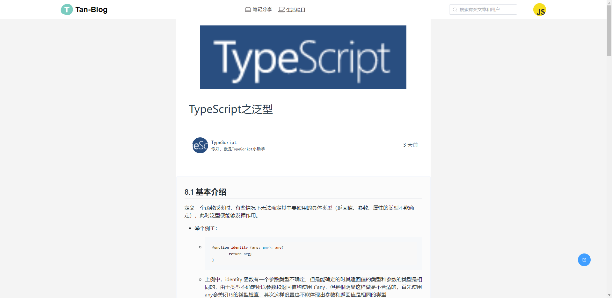

## tan-blog--个人博客网站

前台技术栈：Vue3 \+ TypeScript + ElementPlus + Pinia + VueRouter + Sass

后台技术栈：Node.js + Koa + Mysql + Sequelize ORM

#### 博客预览地址：[点击这里预览](http://47.106.39.120/#/home)

## 本博客所使用的markdown插件

[mavonEditor v3.0.0]: https://github.com/hinesboy/mavonEditor

官方安装文档：
| Vue2 |  |
| ---- | ------------------------------------------------------------ |
| **Vue3** |  |

## 下面是博客预览图：

#### 一、首页模块

首页模块分别展示：笔记分类、最新发布排序、浏览量排序、热门文章、热门用户

##### 

#### 二、登录注册模块

1.登录

2.注册

#### 三、文章模块

1.发布文章

2.展示文章

#### 四、用户信息模块

1.查看用户个人主页或他人主页

2.设置用户信息

